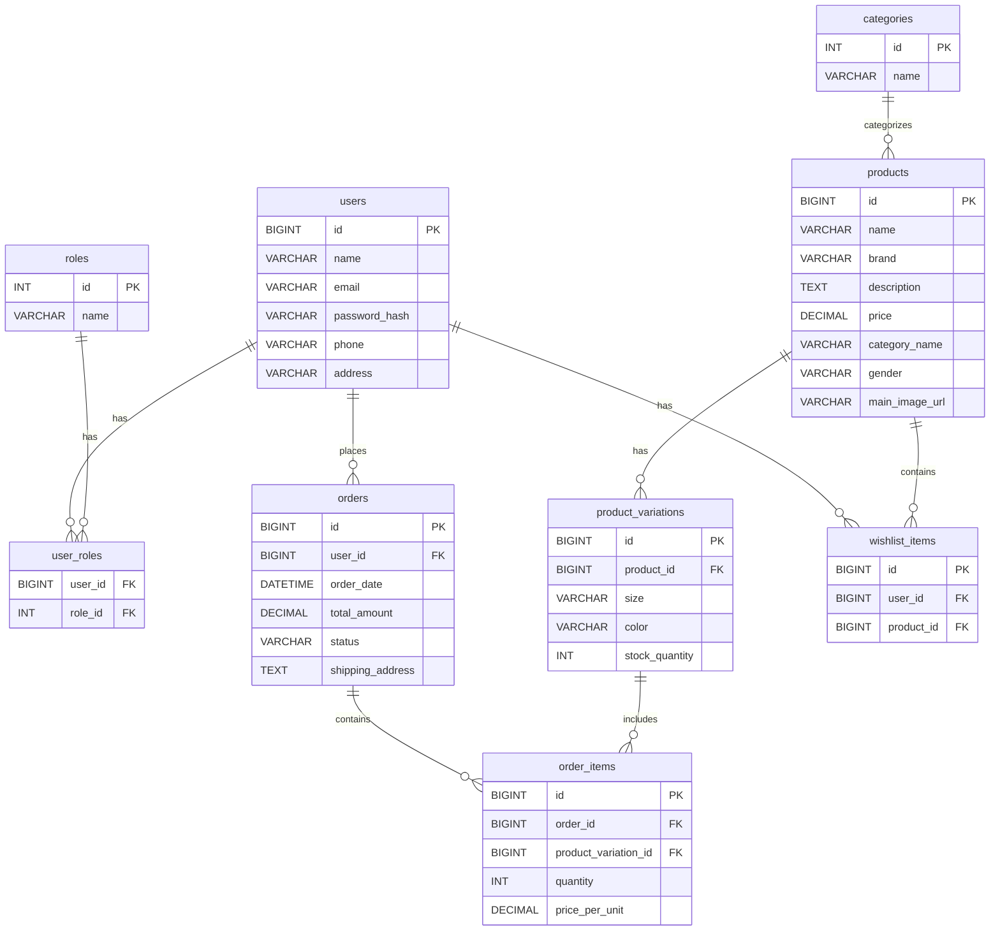

# ShoeShow E-commerce Platform Documentation

## Table of Contents

1.  [Introduction to Project & Business Domain](introduction.md)
2.  [Used Technologies & Frameworks](technologies.md)
3.  [Project Design & Architecture](architecture.md)
4.  [User Manual](user_manual.md)
5.  [Setup and Installation](setup_installation.md)
6.  [Contribution Guidelines](contribution_guidelines.md)
7.  [Troubleshooting and FAQs](troubleshooting_faq.md)
8.  [AI Chatbot Implementation Details](ai_chatbot_details.md)
9.  [Future Enhancements](future_enhancements.md)
10. [Deployment](deployment.md)


# 1. Introduction to Project & Business Domain

## 1.1 Project Overview

## 1.2 Problem Statement

## 1.3 Objectives of the Platform

## 1.4 Target Audience & Users

## 1.5 Business Domain: Footwear E-commerce

## 1.6 Key Features & Functional Requirements


### Project Overview

ShoeShow is a modern, responsive e-commerce web application designed for premium footwear. It aims to provide a seamless online shopping experience for customers and efficient management tools for administrators. The platform is structured into three main components:

*   **ShoeShow-frontend-user:** The customer-facing application, built with Angular, handling user interactions, product browsing, shopping cart, wishlist, and order management. This frontend also integrates an AI chatbot to enhance user support and engagement.
*   **ShoeShow-frontend-admin:** An administrative frontend, also built with Angular, designed for managing products, users, and orders.
*   **ShoeShow-backend:** The core backend system, likely built with Spring Boot , responsible for managing business logic, APIs, and data persistence. It serves both frontend applications.

This project is a graduation project, emphasizing comprehensive documentation to showcase technical proficiency and a deep understanding of e-commerce principles.

### Problem Statement

Many online footwear shopping platforms often present challenges such as poor user experience, limited product filtering options, and inefficient backend management tools. These issues can lead to customer dissatisfaction, high cart abandonment rates, low user retention, and increased administrative overhead. ShoeShow aims to address these common pain points by providing a streamlined, intuitive, and feature-rich e-commerce solution.

### Objectives of the Platform

The primary objectives of the ShoeShow platform are to:

*   Provide a smooth and intuitive online shopping experience for customers.
*   Enable real-time product browsing, filtering, and search capabilities.
*   Support robust user registration, authentication, and secure session handling.
*   Allow customers to effectively manage their shopping cart, place orders, and view their order history.
*   Offer a scalable and maintainable backend system for comprehensive management of products, orders, and users.
*   Lay a solid foundation for future extensions, such as advanced analytics, mobile applications, or further AI integrations.
*   Enhance user interaction and support through an integrated AI chatbot.

### Target Audience & Users

The ShoeShow platform is designed to serve two primary user groups:

*   **Customers:** End-users who browse, purchase, and manage footwear orders through the user-facing frontend. This includes individuals seeking a convenient and engaging online shopping experience.
*   **Admins:** Internal team members responsible for managing inventory, user accounts, and order fulfillment via the administrative frontend. This role requires tools for efficient operational control.
*   **Developers:** Individuals involved in the implementation, maintenance, and future development of the platform. This documentation is crucial for their understanding of the codebase and architecture.
*   **Stakeholders:** Project evaluators and interested parties who require a high-level understanding of the project's capabilities and technical foundation.
*   **Future Contributors:** New team members who will be onboarded to the project and require comprehensive resources for quick understanding and effective collaboration.

### Business Domain: Footwear E-commerce

ShoeShow operates within the dynamic and rapidly expanding **footwear e-commerce** domain. This sector of the retail industry is characterized by specific requirements and opportunities, including:

*   **Diverse Product Catalog:** Managing a wide array of footwear categories (e.g., sneakers, casual shoes, formal wear), brands, and styles.
*   **Variations:** Handling product variations such as size, color, and material, which are critical for customer selection.
*   **Seasonal Trends:** Adapting to fast-changing fashion trends and seasonal demands in the footwear market.
*   **High-Quality Visuals:** The necessity of showcasing products with high-resolution images and potentially 3D models to provide an immersive shopping experience.
*   **Secure Transactions:** Implementing robust security measures for payment processing and personal data protection.
*   **Efficient Logistics:** Supporting order fulfillment, shipping, and returns processes.

ShoeShow addresses these domain-specific challenges by providing dynamic catalog management, high responsiveness, and secure order handling, all integrated within a user-friendly interface.

### Key Features & Functional Requirements

The ShoeShow platform encompasses a range of core functionalities designed to meet the needs of both customers and administrators:

**Core Functionalities (Customer Side):**

*   **User Authentication:** Secure user registration and login with JWT authentication.
*   **Product Browsing:** Comprehensive product listing with pagination, advanced search filters (by brand, size, color, gender, category, keyword), and sorting options.
*   **Product Details:** Detailed product views including multiple images, descriptions, pricing, and available variations (size, color, stock levels).
*   **Shopping Cart Management:** Functionality to add, remove, and update product quantities in the shopping cart.
*   **Wishlist Management:** Ability to save products for future consideration.
*   **Secure Checkout:** A streamlined and secure checkout process with order summary and payment integration.
*   **Order History:** Users can view their past orders, including status and item details.
*   **AI Chatbot Integration:** An interactive AI chatbot within the user frontend to provide instant support, answer queries, and enhance the overall user experience.

**Backend Capabilities:**

*   **RESTful APIs:** Exposure of well-defined RESTful APIs for all customer-facing and administrative features.
*   **Role-Based Security:** Implementation of role-based access control (RBAC) with JWT tokens to secure endpoints and differentiate between user and admin privileges.
*   **Data Management:** Structured data models using DTOs (Data Transfer Objects) and service layers for efficient data handling and business logic execution.
*   **Product Management:** APIs for creating, updating, deleting, and retrieving product information.
*   **User Management:** APIs for managing user accounts and profiles.
*   **Order Processing:** APIs for handling order creation, status updates, and retrieval.

**Admin Specific Capabilities (via Admin Frontend):**

*   **Product Administration:** Tools to manage the product catalog, including adding new products, updating existing ones, and managing inventory.
*   **User Administration:** Functionality to view and manage user accounts.
*   **Order Administration:** Ability to view, update, and manage customer orders.


# 2. Used Technologies & Frameworks

## 2.1 Frontend Technologies

## 2.2 Backend Technologies

## 2.3 Database

## 2.4 Security

## 2.5 Other Tools


# 2. Used Technologies & Frameworks

This section provides a detailed overview of the technologies, frameworks, and tools utilized in the development of the ShoeShow e-commerce platform. The selection of these technologies was based on factors such as performance, scalability, maintainability, community support, and suitability for e-commerce applications and graduation project requirements.

## 2.1 Frontend Technologies

The user-facing and administrative frontends of the ShoeShow platform are built using **Angular**, a powerful and widely-used TypeScript-based framework for building single-page applications. Angular was chosen for its:

*   **Modular Architecture:** Facilitates the organization of code into reusable modules, improving maintainability and scalability.
*   **Component-Based Structure:** Enables the creation of reusable UI components, accelerating development and promoting consistency.
*   **Two-Way Data Binding:** Simplifies synchronization between the model and the view.
*   **Robust CLI:** Provides a command-line interface for efficient project scaffolding, development, testing, and building.
*   **Strong Community Support:** A large and active community contributes to a wealth of resources, libraries, and tools.

Both frontends leverage **Angular Material** for UI components, providing a consistent and responsive design based on Google's Material Design principles. **Bootstrap** grid system is also used for layout and responsiveness, as indicated in the `README.md` file [1].

For the AI chatbot integration within the user frontend, the application uses Angular's `HttpClient` module to communicate directly with the Groq API, utilizing the `"meta-llama/llama-4-scout-17b-16e-instruct"` model for AI responses. The chat interface and message handling are implemented using Angular components and services, allowing real-time interaction with the AI assistant. All API requests and responses are managed through Angular services, ensuring seamless integration between the frontend and the Groq-powered AI backend.
## 2.2 Backend Technologies

The ShoeShow backend is primarily developed using **Spring Boot**, a popular Java-based framework that simplifies the creation of stand-alone, production-grade Spring applications. Spring Boot was selected for its:

*   **Rapid Application Development:** Auto-configuration and conventions significantly reduce development time.
*   **Embedded Servers:** Allows for easy deployment as a single JAR file with an embedded web server (like Tomcat).
*   **RESTful API Support:** Provides robust features for building RESTful web services using Spring MVC.
*   **Layered Architecture Support:** Naturally supports the implementation of layered architectures (Controller, Service, Repository).
*   **Dependency Management:** Simplifies the management of project dependencies.

The backend utilizes **Spring Data JPA** for the data persistence layer, providing an abstraction over JPA (Java Persistence API) implementations like Hibernate. This simplifies database interactions and reduces boilerplate code for CRUD operations and custom queries. The main programming language used is **Java 22**, .

**Lombok** is used to minimize boilerplate code in Java classes, such as getters, setters, constructors, and logging annotations (`@Data`, `@AllArgsConstructor`, `@Slf4j`) [2].

**Jakarta EE** is also mentioned, indicating the use of modular enhanced Java APIs [2].

## 2.3 Database

The ShoeShow platform utilizes a relational database for persistent data storage. The provided documentation indicates support for **MySQL** [2, 3], a widely-used open-source relational database management system known for its performance, reliability, and ease of use. The schema includes normalized tables for users, products, and orders, and order items [2].

**Flyway** is employed for database schema version control, managing database migrations through SQL scripts located in `/src/main/resources/db/migration/` [2]. This ensures that database schema changes are tracked, applied consistently, and are reversible.

## 2.4 Security

Security in the ShoeShow platform is handled using **Spring Security** in the backend, with a focus on **JWT (JSON Web Tokens)** for authentication and authorization [2, 3]. JWTs are used for secure, stateless communication between the frontend and backend. Key aspects of the security implementation include:

*   **Bearer Authentication Scheme:** JWT tokens are sent in the `Authorization: Bearer <jwt>` header [3].
*   **Role-Based Access Control (RBAC):** Endpoints and functionalities are protected based on user roles (e.g., USER, ADMIN) using annotations like `@PreAuthorize` [2, 3].
*   **Password Hashing:** User credentials are securely stored using hashing algorithms (likely BCrypt, a common practice with Spring Security) [3].
*   **CORS Configuration:** Cross-Origin Resource Sharing is configured to allow secure communication between the frontend and backend running on different origins [2].

## 2.5 Other Tools

Several other tools are used in the development and management of the ShoeShow project:

*   **IDEs:** **IntelliJ IDEA** is preferred for backend development, while **Visual Studio Code** is used for frontend development [2].
*   **Version Control:** **Git** is used for source code management, and **GitHub** hosts the repositories, facilitating collaboration through features like pull requests and issues [2]. The project structure across multiple repositories within a parent repository suggests the potential use of Git submodules, which should be mentioned for clarity on managing the overall project codebase.
*   **API Testing:** **Postman** is used for testing and documenting RESTful APIs during backend development and integration testing [2].
*   **API Documentation:** **Springdoc/OpenAPI (Swagger)** is integrated into the backend to generate interactive API documentation and a UI (accessible typically at `/swagger-ui.html`) for exploring and testing endpoints [2, 3].
*   **Logging:** **SLF4J/Logback** is used for logging, with configuration for log patterns and levels managed in `application.properties` [2]. Logs are typically written to a file (e.g., `logs/app.log`) [3].
*   **Build and Dependency Management:** **Maven** is used for the backend project to manage dependencies, build the project, and handle plugins [2]. For the Angular frontends, **npm** is used for dependency management and running scripts (e.g., `npm install`, `ng serve`, `ng build`) [1].
*   **Deployment Tools (Optional):** The documentation mentions the potential use of **Docker** for containerization and **CI/CD Tools** (like GitHub Actions or Jenkins) for automating build and test pipelines, particularly for production setups [2].


## 2.6 Git Submodule Structure

The ShoeShow project employs a **Git superproject pattern** to manage its multi-component architecture. This means that the main `ShoeShow-E-commerce-Web-Application` repository acts as a superproject that coordinates three independent software components as Git submodules [4]. This approach allows for separate development teams to work on different components while maintaining version consistency across the integrated system.

The submodules are configured as follows:

| Component              | Local Path                 | Repository URL                                         | Branch     |
| :--------------------- | :------------------------- | :----------------------------------------------------- | :--------- |
| Backend API            | `ShoeShow-backend`         | `https://github.com/ahmedelbrmbaly/ShoeShow-backup.git` | `main`     |
| User Frontend          | `ShoeShow-frontend-user`   | `https://github.com/ahmedelbrmbaly/ShoeShow-frontend-user.git` | `master` (or `ayb/ai-bot` for AI features) |
| Admin Frontend         | `ShoeShow-frontend-admin`  | `https://github.com/ahmedelbrmbaly/ShoeShow-frontend-admin.git` | `master` (or `auth-branch` for authentication) |

This structure is crucial for understanding how the different parts of the ShoeShow platform are versioned and integrated. When cloning the main repository, it is essential to initialize and update the submodules to get the complete project codebase, as detailed in the [Setup and Installation](setup_installation.md) section.

[4] https://deepwiki.com/Hashim-Sobhi/ShoeShow-E-commerce-Web-Application


# 3. Project Design & Architecture

## 3.1 High-Level System Architecture

## 3.2 Backend Architecture

## 3.3 Frontend Architecture

## 3.4 Database Design

## 3.5 Security Model

## 3.6 Integration Between Frontend & Backend


# 3. Project Design & Architecture

This section provides a comprehensive technical overview of the ShoeShow platform's design and architecture. It details how the various components—backend, frontends, and database—are structured, interact, and integrate to deliver a robust and scalable e-commerce solution. Understanding this architecture is crucial for development, maintenance, and future enhancements.

## 3.1 High-Level System Architecture

The ShoeShow system adopts a **client-server architecture**, a widely recognized and effective pattern for web applications. This architecture clearly separates the user interface (client) from the data storage and business logic (server), promoting modularity, scalability, and independent development of each component. The primary components of this high-level architecture are:

*   **Frontend (Angular Applications):** This layer consists of two distinct Angular applications: `ShoeShow-frontend-user` and `ShoeShow-frontend-admin`. These applications are responsible for rendering the user interface, handling user interactions, and communicating with the backend via HTTP requests. The user frontend also incorporates an AI chatbot for enhanced user engagement.
*   **Backend (Spring Boot Application):** This serves as the central hub for business logic, data processing, and API management. Built with Spring Boot, it exposes RESTful APIs that are consumed by both frontend applications. It manages user authentication, product catalog, order processing, and other core e-commerce functionalities.
*   **Database (MySQL):** This is the persistent data storage layer, housing all critical information such as user profiles, product details, order records, and more. The backend interacts with the database through a robust ORM (Object-Relational Mapping) framework.

This separation ensures that each component can be developed, deployed, and scaled independently, contributing to the overall resilience and performance of the system.

```mermaid
graph TD
    A[User (ShoeShow-frontend-user)] -->|HTTP/REST API| B(ShoeShow-backend)
    C[ShoeShow-frontend-admin] -->|HTTP/REST API| B
    B -->|JPA/JDBC| D[MySQL Database]
    B -- Swagger/OpenAPI --> E[API Documentation]
    subgraph User Interaction
        A -- AI Chatbot Integration --> F[External AI Service]
    end

    style A fill:#f9f,stroke:#333,stroke-width:2px
    style B fill:#f9f,stroke:#333,stroke-width:2px
    style C fill:#f9f,stroke:#333,stroke-width:2px
    style D fill:#bbf,stroke:#333,stroke-width:2px
    style E fill:#bfb,stroke:#333,stroke-width:2px
    style F fill:#fbb,stroke:#333,stroke-width:2px
```
*Figure 1: High-Level System Architecture of ShoeShow Platform*

## 3.2 Backend Architecture

The ShoeShow backend, built with Spring Boot, adheres to a well-defined **layered architecture** to ensure separation of concerns, maintainability, and testability. This structure is a standard practice in enterprise application development

### 3.2.1 Layered Architecture (Controller, Service, Repository)

*   **Controller Layer:** This is the outermost layer, responsible for handling incoming HTTP requests, validating input, and exposing REST endpoints. Controllers act as the entry point for client applications, translating HTTP requests into calls to the service layer. They are designed to be thin, primarily focusing on request mapping and response formatting [2].
*   **Service Layer:** This layer encapsulates the core business logic of the application. Services orchestrate interactions between repositories, apply business rules, perform validations, and manage transactions. They are responsible for implementing the 


use cases of the application, ensuring that data is processed correctly and consistently [2].
*   **Repository Layer:** This layer provides an abstraction over the database, handling data persistence and retrieval. It typically consists of interfaces extending Spring Data JPA repositories (e.g., `JpaRepository`, `CrudRepository`). These repositories manage interactions with the database using JPA and Hibernate, abstracting away the complexities of direct database access [2].
*   **Domain Layer (Entities, DTOs, Mappers):** This layer defines the core data structures of the application. It includes:
    *   **Entities:** Java objects that map directly to database tables, annotated with `@Entity`. They represent the persistent data model [2].
    *   **DTOs (Data Transfer Objects):** Plain Java objects used to transfer data between layers, particularly between the service layer and the controller layer, and in API requests/responses. DTOs help decouple the internal data model from the API contract, providing flexibility and security [2].
    *   **Mappers:** Components responsible for converting data between Entities and DTOs. This is crucial for maintaining a clear separation between the persistence model and the API model [2].
*   **Configuration Layer:** This layer manages application startup, property sources, security configurations (e.g., Spring Security), and Swagger/OpenAPI documentation setup [2].
*   **Exception Handling:** A centralized exception handling mechanism, often implemented using Spring's `@ControllerAdvice`, ensures that errors are caught and translated into standardized, user-friendly error responses [2].

This layered approach promotes modularity, making the application easier to understand, test, and maintain. Each layer has a distinct responsibility, reducing coupling and improving code organization.

### 3.2.2 RESTful API Structure

The backend exposes its functionalities through RESTful APIs, adhering to standard REST principles:

*   **Statelessness:** Each request from a client to the server must contain all the information needed to understand the request. The server does not store any client context between requests, typically relying on JWTs for authentication [3].
*   **Resource-Oriented:** APIs are designed around resources (e.g., products, users, orders), and standard HTTP methods (GET, POST, PUT, DELETE) are used to perform operations on these resources [3].
*   **Clear Naming Conventions:** Endpoints follow consistent and intuitive naming conventions (e.g., `/api/products`, `/api/users/{userId}/cart`) [3].
*   **Standardized Response Formats:** API responses, including error responses, follow a consistent JSON structure, making them easier for client applications to parse and handle [2]. Paginated resources typically return metadata like `page`, `size`, `total`, and the `items` array [2].

## 3.3 Frontend Architecture

Both the user-facing and admin frontends are built using Angular, following best practices for modern single-page application development. The architecture emphasizes modularity, component reusability, and a clear separation of concerns.

### 3.3.1 Components & Modules

The Angular applications are structured into modules and components:

*   **Feature Modules:** The application is divided into distinct feature modules, each encapsulating a specific business domain or functionality (e.g., `AuthModule`, `ProductModule`, `CartModule`, `OrderModule`, `ProfileModule`). This modularity improves code organization, allows for lazy loading of features (enhancing initial load times), and makes the application easier to scale and maintain [1].
*   **Shared Module:** Contains reusable components, directives, and pipes that are used across multiple feature modules. This promotes code reuse and consistency [1].
*   **Core Module:** Includes services, guards, and interceptors that are used application-wide (e.g., authentication service, API interceptors for adding JWT tokens, route guards for protecting routes). This module is typically imported once in the root `AppModule` [1].
*   **Component-Based Structure:** User interfaces are built as a hierarchy of reusable components. Each component is responsible for a specific part of the UI and its associated logic, promoting a clear separation of concerns and making the UI easier to manage and test [1].

### 3.3.2 Service Layer

Business logic and data fetching operations within the frontend are handled by injectable services. These services encapsulate interactions with the backend APIs, manage application state (where applicable), and provide utility functions. This ensures that components remain focused on presentation, while services handle the underlying data and logic [1].

### 3.3.3 Routing

Angular's routing module (`AppRoutingModule`) is used to manage navigation between different views and application states. It defines the routes for the application, mapping URLs to specific components and enabling a smooth single-page application experience [1].

### 3.3.4 State Management

While the provided documents don't explicitly detail a specific global state management library (like NgRx or Akita), a well-structured Angular application typically employs a consistent approach to manage application-wide state. This could involve using RxJS with BehaviorSubjects in services for simpler state management or a more comprehensive state management library for complex applications. RxJS for reactive programming and component communication.

### 3.3.5 AI Chatbot Integration (User Frontend)

The user frontend (`ShoeShow-frontend-user`) features an AI chatbot integration. This typically involves:

*   **Chatbot Component/Service:** A dedicated Angular component or module responsible for rendering the chatbot interface, capturing user input, and displaying chatbot responses [1].
*   **API Communication:** The chatbot component communicates with a backend AI service (which could be part of the main ShoeShow backend or a separate microservice/third-party API) to process user queries and retrieve intelligent responses. This communication is facilitated through Angular services making HTTP requests [1].
*   **Data Flow:** User queries are sent from the frontend to the AI service, processed, and responses are sent back to the frontend for display. This involves managing the conversation flow and potentially integrating with other backend services (e.g., product catalog) for context-aware responses [1].

## 3.4 Database Design

The backend relies on a MySQL relational database. The database schema is managed using **Flyway**, which ensures version-controlled and automated database migrations [2].

### 3.4.1 Entity-Relationship Diagram (ERD)

An ERD visually represents the structure of the database, including tables, columns, and relationships between them. While a specific ERD image is not provided in the text documents,  suggests including one and outlines key relationships. Based on the described entities and functionalities, a conceptual ERD would include tables suchs as:

*   **users:** Stores user account information (ID, name, email, password hash, roles, phone, address).
*   **roles:** Defines user roles (e.g., USER, ADMIN).
*   **user_roles:** A join table for the many-to-many relationship between users and roles.
*   **products:** Stores product catalog information (ID, name, brand, description, price, category, gender, main image URL).
*   **product_variations:** Stores details about product variations like size, color, and stock quantity, linked to the `products` table.
*   **categories:** Stores product categories.
*   **orders:** Stores customer order information (ID, user ID, order date, total amount, status, shipping address).
*   **order_items:** Stores individual items within each order (ID, order ID, product ID, quantity, price per unit).
*   **cart:** Could be a table to persist shopping cart items if not managed transiently or in client-side storage.
*   **wishlist_items:** Stores items added to a user's wishlist.


*Figure 2: Conceptual Entity-Relationship Diagram for ShoeShow Platform*

### 3.4.2 Major Tables Overview


| Table Name         | Purpose                                                                 |
| ------------------ | ----------------------------------------------------------------------- |
| `users`            | Stores user data (credentials, profile information) and roles.          |
| `products`         | Stores core product catalog information.                                |
| `product_variations` | Details specific variations of products like size, color, and stock.    |
| `orders`           | Stores customer order headers.                                          |
| `order_items`      | Stores individual line items within each customer order.                |
| `roles`            | Defines user authorization roles (e.g., USER, ADMIN).                   |
| `categories`       | Stores product categories for organization and filtering.               |
| `wishlist_items`   | Stores products that users have added to their wishlist.                |

## 3.5 Security Model

The security of the ShoeShow platform is a critical aspect, implemented primarily in the backend using Spring Security and JWTs.

*   **JWT Authentication:** User authentication is managed via JSON Web Tokens. Upon successful login, the backend issues a JWT to the client. This token is then included in the `Authorization: Bearer <token>` header for subsequent requests to protected endpoints [3].
*   **Role-Based Access Control (RBAC):** Spring Security's `@PreAuthorize` annotation and similar mechanisms are used to enforce RBAC. Different user roles (e.g., `USER`, `ADMIN`) have varying levels of access to APIs and functionalities. For instance, admin-specific APIs are restricted to users with the `ADMIN` role [3].
*   **Password Hashing:** User passwords are not stored in plaintext. Instead, they are securely hashed using a strong hashing algorithm (e.g., BCrypt) before being stored in the database. Spring Security provides robust support for password encoding [3].
*   **CORS Configuration:** Proper Cross-Origin Resource Sharing (CORS) policies are configured on the backend to allow requests from the frontend domains while preventing unauthorized cross-origin requests [2].

## 3.6 Integration Between Frontend & Backend

The integration between the Angular frontends and the Spring Boot backend is achieved through RESTful API calls. Key aspects of this integration include:

*   **HTTP Communication:** Frontends make HTTP requests (GET, POST, PUT, DELETE) to the backend's REST endpoints to retrieve, create, update, and delete data. Angular's `HttpClient` module is used for this purpose [1].
*   **JSON Data Exchange:** Data is exchanged between the frontend and backend primarily in JSON format. The backend exposes JSON APIs, and the frontends consume and send JSON payloads [2].
*   **Authentication Flow:**
    1.  User attempts to log in via the frontend.
    2.  Frontend sends user credentials to the backend's authentication API.
    3.  Backend authenticates the user and, if successful, generates a JWT and sends it back to the frontend.
    4.  Frontend stores the JWT (e.g., in local storage or session storage).
    5.  For subsequent authenticated requests, the frontend includes the JWT in the `Authorization: Bearer <token>` header.
    6.  Backend validates the JWT for each request to ensure the user is authenticated and authorized [3].
*   **Error Handling:** Both frontend and backend implement robust error handling mechanisms. The backend returns meaningful HTTP status codes and error messages in JSON format, which the frontend can then interpret and display to the user [2].
*   **API Documentation (Swagger UI):** The backend provides interactive API documentation via Swagger UI, which is invaluable for frontend developers to understand available endpoints, request/response formats, and test API calls directly [2, 3]. This facilitates seamless integration and reduces communication overhead between frontend and backend teams.


# 4. User Manual

## 4.1 Accessing the System

## 4.2 User Roles and Permissions

## 4.3 Feature Walkthrough


# 4. User Manual

This section serves as a practical guide for both end-users (customers) and administrators on how to effectively navigate and utilize the ShoeShow e-commerce platform. It covers system access, defined user roles and their permissions, and provides a detailed walkthrough of key features and functionalities.

## 4.1 Accessing the System

The ShoeShow platform is a web-based application accessible through a standard web browser. Users can access the customer-facing frontend, while administrators will use a separate admin frontend. The specific URLs for accessing the system will depend on the deployment environment (e.g., `https://shoeshow.app` for a production environment, or `http://localhost:4200/` for a local development setup).

### Requirements for Access:

*   **Modern Web Browser:** Compatible with popular browsers such as Google Chrome, Mozilla Firefox, Apple Safari, or Microsoft Edge.
*   **Internet Connection:** Required for accessing the deployed application. For local development, an internet connection might be needed for initial setup and dependency downloads.
*   **User Credentials:** Registered users will need their email and password to log in. Administrators will require specific admin credentials.

## 4.2 User Roles and Permissions

The ShoeShow platform defines distinct roles with clearly scoped permissions to ensure secure and appropriate access to functionalities. The primary roles are Customer and Admin.

### 4.2.1 Customer Role

**Description:** This role is assigned to end-users who interact with the `ShoeShow-frontend-user` application. Customers can browse products, make purchases, and manage their personal shopping experience.

**Permissions:**

*   **Registration and Login:** Create a new account and securely log in to the platform.
*   **Product Browsing:** View the product catalog, apply filters, search for specific items, and view detailed product information.
*   **Shopping Cart Management:** Add products to the cart, adjust quantities, and remove items.
*   **Wishlist Management:** Add and remove products from their personal wishlist.
*   **Order Placement:** Proceed through the checkout process to place new orders.
*   **Order History:** View a comprehensive history of their past orders, including order status and details.
*   **Profile Management:** Access and update their personal profile information (e.g., name, email, shipping address).
*   **AI Chatbot Interaction:** Engage with the integrated AI chatbot for support and queries.

### 4.2.2 Admin Role

**Description:** This role is assigned to internal team members who manage the e-commerce operations through the `ShoeShow-frontend-admin` application. This role has elevated privileges to oversee and manage various aspects of the platform.

**Permissions:**

*   **Product Management:** Full control over the product catalog, including adding new products, editing existing product details, managing stock levels, and deleting products.
*   **User Management:** View and manage user accounts, which may include functionalities like viewing user details or managing user roles (though specific user management features are not fully detailed in provided docs, it's a common admin capability).
*   **Order Management:** View all customer orders, update order statuses (e.g., pending, shipped, delivered, canceled), and manage order details.
*   **Access to Admin-Specific Features:** Access to any other administrative tools or reports implemented in the admin frontend.

**Security Note:** Admin functionalities are typically protected by role-based access control, ensuring that only authenticated users with the `ADMIN` role can access sensitive endpoints and features [2].

## 4.3 Feature Walkthrough

This section provides a step-by-step guide to the main user flows and features available on the ShoeShow platform. It aims to provide clear instructions for both customers and administrators, with suggestions for visual aids (screenshots) to enhance understanding.

### 4.3.1 User Registration & Login

**Purpose:** Allows new users to create an account and existing users to access their personalized shopping experience.

**Customer Flow:**

1.  **Navigate to Authentication Page:** Open the ShoeShow user frontend in your web browser. You will typically find 


links or buttons for "Login" or "Sign Up" on the homepage or in the navigation bar.
2.  **Choose Registration or Login:**
    *   **To Register:** Click on the "Sign Up" or "Register" link. You will be directed to a registration form.
    *   **To Login:** Click on the "Login" or "Sign In" link. You will be directed to a login form.
3.  **Complete the Form:**
    *   **For Registration:** Fill in the required details, which typically include your name, email address, and a password. Ensure you choose a strong password. The system likely performs validation on these fields (e.g., email format, password strength).
    *   **For Login:** Enter your registered email address and password.
4.  **Submit the Form:** Click the "Sign Up" or "Login" button to submit the form.
5.  **Authentication and Redirection:**
    *   **Upon successful Registration:** If the provided information is valid and the registration is successful, your account will be created. You will likely be automatically logged in and redirected to the product listing page or the homepage, ready to start shopping [1].
    *   **Upon successful Login:** If your email and password match a registered account, you will be authenticated and logged into the platform. You will then be redirected to the product listing page, your dashboard, or the homepage.

**Security:** The platform uses JWT (JSON Web Tokens) for secure authentication. Upon successful login, a JWT is issued by the backend and stored on the client side (e.g., in local storage or cookies). This token is then sent with subsequent requests to protected backend endpoints to verify your identity and permissions [2, 3].

**Admin Login:** The process for admin login is similar but is performed through the separate `ShoeShow-frontend-admin` application. Administrators will use their designated admin credentials to access the administrative dashboard and functionalities.

### 4.3.2 Browsing & Searching for Shoes

**Purpose:** Allows users to explore the available product catalog and find specific footwear items.

**Customer Flow:**

1.  **Access the Product Catalog:** After logging in (or as a guest user, if browsing is allowed without login), you will typically land on the product listing page or can navigate to it via a "Shop" or "Products" link.
2.  **View Products:** The page displays a grid or list of available shoes. Products are usually shown with their image, name, brand, and price.
3.  **Filtering Products:** Use the available filter options to narrow down the product list. Filters can include:
    *   **Category:** (e.g., Sneakers, Casual, Formal, Boots) [1]
    *   **Gender:** (e.g., Male, Female, Unisex) [1]
    *   **Brand:** Filter by specific shoe brands [1]
    *   **Size:** Filter by available shoe sizes [1]
    *   **Color:** Filter by available colors [1]
4.  **Sorting Products:** Sort the product list based on criteria such as price (low to high, high to low), new arrivals, or popularity [2].
5.  **Searching Products:** Use the search bar to find products by keywords (e.g., "running shoes", "red sneakers") [2]. Type your query into the search bar and press Enter or click the search icon. The product list will update to show results matching your search term.
6.  **Pagination/Loading More Products:** If there are many products, they may be displayed in pages. Look for pagination controls at the bottom of the list or a "Load More" button to view additional products.

**Best Practice:** The platform aims to provide efficient filtering and searching to help you quickly find the shoes you are looking for. Combining filters and search terms can further refine your results.

### 4.3.3 Product Details Page

**Purpose:** Provides in-depth information about a specific product, including variations and options to add to the cart or wishlist.

**Customer Flow:**

1.  **Navigate to Product Details:** From the product listing page, click on the image or name of a product you are interested in. This will take you to the Product Details page.
2.  **View Product Information:** The page displays detailed information about the selected shoe, including:
    *   **High-Quality Images:** Multiple images of the product, often with a gallery or carousel to view different angles [2].
    *   **Product Name and Brand:** The full name and brand of the shoe.
    *   **Description:** A detailed description of the product, including materials, features, and style [2].
    *   **Price:** The current price of the shoe.
    *   **Available Variations:** Options for selecting size and color. The available stock quantity for each variation may also be displayed [1, 2].
3.  **Select Variations:** Choose the desired size and color from the available options. The system may update the displayed stock quantity based on your selection.
4.  **Add to Cart:** Once you have selected the desired variations, click the "Add to Cart" button to add the product to your shopping cart.
5.  **Add to Wishlist:** If you want to save the product for later without purchasing it immediately, click the "Add to Wishlist" button.

**Visuals:** The Product Details page is designed to showcase the product effectively with clear images and easy-to-use options for selecting variations.

### 4.3.4 Cart and Checkout Process

**Purpose:** Allows users to review selected items, make final adjustments, and complete the purchase.

**Customer Flow:**

1.  **Access the Shopping Cart:** Click on the shopping cart icon, usually located in the header or navigation bar. This will take you to the Shopping Cart page.
2.  **Review Cart Contents:** The page lists all the products you have added to your cart, showing the product image, name, selected variations, quantity, and price for each item.
3.  **Adjust Quantity:** You can increase or decrease the quantity of each item in your cart. The total price for that item and the overall cart total will update automatically [1].
4.  **Remove Items:** To remove an item from your cart, click the "Remove" or "Delete" button associated with that item.
5.  **Apply Coupons/Discounts (If Available):** If the platform supports coupons or discount codes, there may be a field to enter and apply them, which will adjust the total price.
6.  **Proceed to Checkout:** Once you are satisfied with the items in your cart, click the "Proceed to Checkout" or "Checkout" button.
7.  **Provide Shipping Information:** You will be prompted to enter or select your shipping address. If you are a registered user, your saved addresses may be available.
8.  **Provide Payment Information:** Enter your payment details (e.g., credit card information, or select a payment method like PayPal). The platform ensures secure payment processing.
9.  **Review Order Summary:** Before finalizing the order, you will see an order summary page detailing the items, quantities, prices, shipping cost, taxes (if applicable), and the total amount.
10. **Place Order:** Review the order summary carefully and click the "Place Order" or "Confirm Purchase" button to complete the transaction. Your order will be submitted to the backend for processing.

**Security:** The checkout process is secured to protect your personal and payment information.

### 4.3.5 Order History

**Purpose:** Allows registered users to view a record of their past purchases.

**Customer Flow:**

1.  **Access Order History:** Navigate to your user profile or account section, typically accessible from the header or a user menu. Look for a link like "Order History" or "My Orders".
2.  **View List of Orders:** The Order History page displays a list of your past orders, usually showing the order date, a unique order number, the total amount, and the current status of the order (e.g., Pending, Processing, Shipped, Delivered, Canceled).
3.  **View Order Details:** Click on a specific order in the list to view its detailed information. This page will show the items included in the order, their quantities, prices, the shipping address, and a more detailed breakdown of the order status.

**Best Practice:** The order history provides a convenient way to track your purchases and refer back to past orders.

### 4.3.6 Admin Dashboard

**Purpose:** Provides administrators with tools to manage the e-commerce platform's operations.

**Admin Flow:**

1.  **Access Admin Frontend:** Navigate to the URL for the ShoeShow admin frontend.
2.  **Admin Login:** Log in using your designated administrator credentials.
3.  **Navigate the Dashboard:** Upon successful login, you will access the admin dashboard, which provides access to various management sections.
4.  **Manage Products:** Go to the Product Management section to:
    *   View a list of all products.
    *   Add new products, providing details like name, description, price, brand, category, gender, and uploading images.
    *   Edit existing product information, including variations and stock levels.
    *   Delete products.
5.  **Manage Users:** Access the User Management section to view a list of registered users. (Specific functionalities here would depend on implementation, but could include viewing user details or managing roles).
6.  **Manage Orders:** Go to the Order Management section to:
    *   View a list of all customer orders.
    *   View detailed information for each order.
    *   Update the status of orders (e.g., mark as shipped, delivered, or canceled).
7.  **Access Other Admin Features:** Explore other sections of the dashboard for additional administrative functionalities, such as viewing logs or reports, if implemented.

**Note:** The Admin Dashboard is a separate application from the customer frontend and is secured to ensure only authorized personnel can access it.


# 5. Setup and Installation

This section provides detailed instructions for setting up the ShoeShow e-commerce platform in a local development environment. It covers the prerequisites, cloning the repositories, installing dependencies, and running each component (frontend user, frontend admin, and backend).

## 5.1 Prerequisites

Before you begin, ensure you have the following software installed on your system:

*   **Node.js:** Version 18 or higher is recommended for the Angular frontends. You can download it from [nodejs.org](https://nodejs.org/).
*   **Angular CLI:** Version 20 or higher. If you don't have it installed, you can install it globally using npm:

    ```bash
    npm install -g @angular/cli
    ```

*   **Java Development Kit (JDK):** Version 22 or higher is required for the Spring Boot backend. You can download it from Oracle or use OpenJDK.
*   **Maven:** Version 3.x or higher is required for building the Spring Boot backend. Download it from [maven.apache.org](https://maven.apache.org/).
*   **MySQL Database:** A running instance of MySQL database. You can install it locally or use a Docker container. Ensure you have a database user with appropriate permissions.
*   **Git:** For cloning the project repositories. Download it from [git-scm.com](https://git-scm.com/).

## 5.2 Repository Structure and Cloning

The ShoeShow project is organized into multiple GitHub repositories, all nested under a parent repository `ShoeShow-E-commerce-Web-Application`. This structure suggests the use of Git submodules for managing the different components. To set up the project, you should clone the parent repository and then initialize its submodules.

1.  **Clone the Parent Repository:**

    ```bash
    git clone https://github.com/Hashim-Sobhi/ShoeShow-E-commerce-Web-Application.git
    cd ShoeShow-E-commerce-Web-Application
    ```

2.  **Initialize and Update Submodules:**

    ```bash
    git submodule update --init --recursive
    ```

    This command will clone the `ShoeShow-frontend-user`, `ShoeShow-frontend-admin`, and `ShoeShow-backend` repositories into their respective directories within the parent repository.

    *   `ShoeShow-frontend-user` (located at `ShoeShow-E-commerce-Web-Application/ShoeShow-frontend-user`)
    *   `ShoeShow-frontend-admin` (located at `ShoeShow-E-commerce-Web-Application/ShoeShow-frontend-admin`)
    *   `ShoeShow-backend` (located at `ShoeShow-E-commerce-Web-Application/ShoeShow-backend`)

    **Note:** The `ShoeShow-frontend-user` repository has a specific branch `ayb/ai-bot` for AI chatbot integration, and `ShoeShow-frontend-admin` has an `auth-branch`. The `git submodule update --init --recursive` command should pull the correct branches as configured in the parent repository.

## 5.3 Backend Setup (ShoeShow-backend)

1.  **Navigate to the Backend Directory:**

    ```bash
    cd ShoeShow-backend
    ```

2.  **Configure Database Connection:**

    Open the `application.properties` file (typically located at `src/main/resources/application.properties`) and configure your MySQL database connection details. Replace the placeholders with your actual database URL, username, and password.

    ```properties
    spring.datasource.url=jdbc:mysql://localhost:3306/shoeshow_db?createDatabaseIfNotExist=true
    spring.datasource.username=your_db_username
    spring.datasource.password=your_db_password
    spring.jpa.hibernate.ddl-auto=update # or none, if using Flyway for schema management
    spring.jpa.show-sql=true
    spring.jpa.properties.hibernate.dialect=org.hibernate.dialect.MySQL8Dialect
    
    # Flyway configuration (if used for migrations)
    spring.flyway.enabled=true
    spring.flyway.locations=classpath:db/migration
    ```

    **Note:**  Flyway is used for database migrations. Ensure your `application.properties` file is configured to enable Flyway and point to the correct migration script location (`classpath:db/migration`). Flyway will automatically run pending migrations on application startup.

3.  **Build the Backend Project:**

    ```bash
    mvn clean install
    ```

    This command will compile the Java code, run tests, and package the application into a JAR file.

4.  **Run the Backend Application:**

    ```bash
    java -jar target/shoeshow-backend.jar # Replace shoeshow-backend.jar with the actual generated JAR file name
    ```

    Alternatively, if you are using an IDE like IntelliJ IDEA, you can run the main application class directly.

    The backend application will start, typically on port `8080`. You can verify its status by accessing the Swagger UI at `http://localhost:8080/swagger-ui.html`.

## 5.4 Frontend User Setup (ShoeShow-frontend-user)

1.  **Navigate to the Frontend User Directory:**

    ```bash
    cd ../ShoeShow-frontend-user
    ```

2.  **Install Dependencies:**

    ```bash
    npm install
    ```

    This command will install all the necessary Node.js packages and Angular dependencies defined in `package.json`.

3.  **Configure Backend API Endpoint:**

    You may need to configure the Angular application to point to your running backend API. This is typically done in the environment files (e.g., `src/environments/environment.ts` or `src/environments/environment.development.ts`). Update the API URL to `http://localhost:8080` (or whatever port your backend is running on).

    ```typescript
    export const environment = {
      production: false,
      apiUrl: 'http://localhost:8080/api' // Adjust if your backend API has a different base path
    };
    ```

4.  **Run the Frontend User Application:**

    ```bash
    ng serve
    ```

    The application will start a local development server, typically accessible at `http://localhost:4200/`. The app will automatically reload if you make any code changes.

## 5.5 Frontend Admin Setup (ShoeShow-frontend-admin)

1.  **Navigate to the Frontend Admin Directory:**

    ```bash
    cd ../ShoeShow-frontend-admin
    ```

2.  **Install Dependencies:**

    ```bash
    npm install
    ```

3.  **Configure Backend API Endpoint:**

    Similar to the user frontend, configure the admin frontend to point to your backend API in its environment files.

    ```typescript
    export const environment = {
      production: false,
      apiUrl: 'http://localhost:8080/api' // Adjust if your backend API has a different base path
    };
    ```

4.  **Run the Frontend Admin Application:**

    ```bash
    ng serve
    ```

    The application will start a local development server, typically accessible on a different port (e.g., `http://localhost:4201/` or `http://localhost:4200/` if you stop the user frontend first). Check your console output for the exact port.

## 5.6 Post-Installation Steps

*   **Database Seeding:** If your application requires initial data (e.g., admin users, sample products), you might need to run specific SQL scripts or use a data seeding mechanism provided by the backend.  `db_script.sql` and `script_data.sql` for database setup and initial data [3].
*   **Testing:** Once all components are running, you can perform basic tests to ensure everything is working correctly. For example, try registering a new user, logging in, browsing products, and adding items to the cart.


# 6. Contribution Guidelines

This section outlines the guidelines for contributing to the ShoeShow e-commerce platform. Adhering to these guidelines ensures code quality, consistency, and efficient collaboration among team members and future contributors.

## 6.1 Getting Started

Before making any contributions, ensure you have set up your local development environment as described in the [Setup and Installation](setup_installation.md) section.

1.  **Fork the Repository:** Start by forking the relevant ShoeShow repository (e.g., `ShoeShow-frontend-user`, `ShoeShow-frontend-admin`, or `ShoeShow-backend`) on GitHub.
2.  **Clone Your Fork:** Clone your forked repository to your local machine.

    ```bash
    git clone https://github.com/YOUR_USERNAME/ShoeShow-frontend-user.git
    cd ShoeShow-frontend-user
    ```

3.  **Set Upstream Remote:** Add the original ShoeShow repository as an upstream remote to keep your fork updated.

    ```bash
    git remote add upstream https://github.com/ahmedelbrmbaly/ShoeShow-frontend-user.git
    ```

4.  **Keep Your Fork Synced:** Regularly pull changes from the upstream repository to keep your local branch up-to-date.

    ```bash
    git pull upstream main # or the relevant branch like 'ayb/ai-bot' for frontend-user
    ```

## 6.2 Branching Strategy

The project follows a branching strategy (e.g., Git Flow or a simplified feature branching model) to manage development and releases. Key principles include:

*   **`main` (or `master`) branch:** This branch represents the stable, production-ready code. Direct commits to this branch are generally discouraged.
*   **`develop` branch:** This branch integrates all new features and bug fixes. All feature branches should be merged into `develop`.
*   **Feature Branches:** For each new feature or significant bug fix, create a new branch from `develop`. Name your branches descriptively (e.g., `feature/add-wishlist`, `bugfix/login-issue`).
*   **Hotfix Branches:** For urgent bug fixes in production, create a hotfix branch directly from `main`.

## 6.3 Commit Guidelines

Follow these guidelines for clear and concise commit messages:

*   **Subject Line:** Start with a concise subject line (50-70 characters) that summarizes the change. Use imperative mood (e.g., "Add new product page" instead of "Added new product page").
*   **Body (Optional):** Provide a more detailed explanation of the change, its purpose, and any relevant context. Wrap lines at 72 characters.
*   **Reference Issues:** If the commit relates to a specific issue, reference it in the commit message (e.g., `Fixes #123`, `Closes #456`).

**Example Commit Message:**

```
feat: Implement user registration flow

This commit introduces the complete user registration process, including
frontend form validation, API integration with the backend, and JWT token
handling upon successful registration.

Closes #789
```

## 6.4 Pull Request Process

All contributions should be submitted via Pull Requests (PRs).

1.  **Create a Pull Request:** Once your feature or bug fix is complete and thoroughly tested on your local machine, push your feature branch to your forked repository on GitHub.
2.  **Open a PR:** Go to the original ShoeShow repository on GitHub and open a new Pull Request from your feature branch to the `develop` branch (or `main` for hotfixes).
3.  **Provide a Clear Description:** In the PR description, clearly explain:
    *   What problem your PR solves.
    *   How you solved it.
    *   Any relevant screenshots or GIFs for UI changes.
    *   Any specific areas that require attention during review.
    *   Any specific areas that require attention during review.
4.  **Request Review:** Request reviews from relevant team members. Address any feedback or requested changes promptly.
5.  **Pass CI/CD Checks:** Ensure all automated tests and checks (if configured) pass successfully.
6.  **Merge:** Once approved and all checks pass, your PR will be merged into the target branch.

## 6.5 Coding Standards

Adhere to the project's established coding standards for consistency and readability. While specific style guides are not provided, general best practices include:

*   **Consistent Formatting:** Use consistent indentation, spacing, and naming conventions.
*   **Meaningful Names:** Use descriptive names for variables, functions, and classes.
*   **Code Comments:** Add comments where necessary to explain complex logic or non-obvious code sections.
*   **DRY Principle:** Avoid duplicating code. Refactor common logic into reusable functions or components.
*   **Single Responsibility Principle:** Ensure each function, component, or class has a single, well-defined responsibility.

## 6.6 Testing

All new features and bug fixes should be accompanied by appropriate tests (unit, integration, end-to-end) to ensure functionality and prevent regressions. Run existing tests before submitting a PR to ensure your changes haven't introduced new issues.

*   **Frontend (Angular):** Run unit tests with `ng test` and end-to-end tests with `ng e2e` [1].
*   **Backend (Spring Boot):** Run tests with `mvn test` [2].

[1] /home/ubuntu/upload/README.md


# 7. Troubleshooting and FAQs

This section provides solutions to common issues that developers and users might encounter while setting up, running, or interacting with the ShoeShow e-commerce platform. It also addresses frequently asked questions to provide quick answers and reduce support inquiries.

## 7.1 General Troubleshooting Tips

Before diving into specific issues, consider these general troubleshooting steps:

*   **Check Logs:** Always start by examining the application logs for both frontend and backend. Logs provide valuable information about errors, warnings, and the application's state.
    *   **Backend Logs:** Typically found in `logs/app.log` or printed to the console if running directly [1].
    *   **Frontend Console:** Open your browser's developer console (usually F12) to check for JavaScript errors or network request failures.
*   **Verify Configuration:** Double-check all configuration files (e.g., `application.properties` for backend, `environment.ts` for frontends) to ensure correct values, especially API endpoints and database credentials.
*   **Ensure All Services Are Running:** Confirm that the MySQL database, the Spring Boot backend, and both Angular frontends are running correctly.
*   **Check Network Connectivity:** Ensure there are no network issues preventing communication between the frontend and backend, or between the backend and the database.
*   **Clear Cache/Rebuild:** For frontend issues, try clearing your browser cache or performing a clean build (`npm cache clean --force` then `npm install` and `ng build`). For backend, `mvn clean install` can resolve build-related problems.
*   **Consult Documentation:** Refer back to the [Setup and Installation](setup_installation.md) and [Project Design & Architecture](architecture.md) sections for setup details and system overview.

## 7.2 Common Issues and Solutions

### 7.2.1 Backend Issues

#### Issue: Backend application fails to start.

**Possible Causes:**
*   Incorrect database configuration in `application.properties`.
*   MySQL database not running or inaccessible.
*   Port conflict (e.g., port 8080 is already in use).
*   Missing or incorrect Flyway migration scripts.

**Solutions:**
*   **Database Configuration:** Verify `spring.datasource.url`, `username`, and `password` in `application.properties`. Ensure the database name is correct and the user has privileges.
*   **MySQL Status:** Check if your MySQL server is running. Use `sudo systemctl status mysql` on Linux or check services on Windows.
*   **Port Conflict:** Change the backend port in `application.properties` (e.g., `server.port=8081`) or stop the process using port 8080.
*   **Flyway Migrations:** Check the Flyway logs during startup for migration errors. Ensure SQL scripts in `src/main/resources/db/migration` are valid and correctly versioned [1].

#### Issue: 401 Unauthorized or 403 Forbidden errors from backend APIs.

**Possible Causes:**
*   Missing or invalid JWT token in the request header.
*   User does not have the required role/permissions for the accessed endpoint.
*   JWT token has expired.

**Solutions:**
*   **Login First:** Ensure you are logged in and have received a valid JWT token. The token should be included in the `Authorization: Bearer <token>` header for protected endpoints.
*   **Check Roles:** Verify that the user account you are using has the necessary roles (e.g., `ADMIN` for admin APIs) to access the endpoint. Refer to the [Security Model](architecture.md#35-security-model) section.
*   **Token Expiration:** If the token has expired, you will need to re-authenticate (log in again) to obtain a new token.
*   **CORS Issues:** If the frontend and backend are on different origins, ensure CORS is correctly configured on the backend to allow requests from your frontend's origin.

#### Issue: 404 Not Found for API endpoints.

**Possible Causes:**
*   Incorrect API endpoint URL in the frontend configuration.
*   Backend API not running or not exposing the expected endpoint.
*   Typo in the endpoint path.

**Solutions:**
*   **Verify Frontend URL:** Check the `apiUrl` in your frontend's `environment.ts` file to ensure it points to the correct backend address and base path.
*   **Backend Status:** Confirm the backend application is running and accessible. Check Swagger UI (`http://localhost:8080/swagger-ui.html`) to see available endpoints.
*   **Endpoint Path:** Double-check the exact path of the API endpoint. Remember that paths are case-sensitive.

### 7.2.2 Frontend Issues

#### Issue: Angular application fails to compile or run (`ng serve`).

**Possible Causes:**
*   Missing Node.js dependencies.
*   Incorrect Angular CLI version.
*   Syntax errors in the code.

**Solutions:**
*   **Install Dependencies:** Run `npm install` in the frontend project directory to ensure all dependencies are installed.
*   **Angular CLI Version:** Verify your Angular CLI version (`ng version`) and ensure it meets the project's requirements (v20+ recommended).
*   **Check Console/Terminal:** Review the error messages in your terminal or IDE console. They usually point to the exact file and line number of the syntax error.

#### Issue: Frontend not displaying data or showing blank pages.

**Possible Causes:**
*   Backend API is not running or is inaccessible.
*   Incorrect API endpoint configuration in the frontend.
*   Network issues preventing API calls.
*   JavaScript errors in the browser console.

**Solutions:**
*   **Backend Status:** Ensure the backend is running and accessible. Try accessing a public backend endpoint directly in your browser (e.g., `http://localhost:8080/api/products`).
*   **API URL Configuration:** Verify the `apiUrl` in your frontend's `environment.ts` file is correct.
*   **Browser Console:** Open the browser's developer console (F12) and check the 


Network tab for failed API requests and the Console tab for JavaScript errors.
*   **CORS:** If you see CORS-related errors in the browser console, ensure the backend has proper CORS configuration to allow requests from your frontend origin.

### 7.2.3 Git Submodule Issues

#### Issue: Submodules are not cloned or are empty.

**Possible Causes:**
*   `git submodule update --init --recursive` was not run or failed.
*   Incorrect submodule paths in the parent `.gitmodules` file.

**Solutions:**
*   **Run Submodule Command:** Navigate to the parent repository (`ShoeShow-E-commerce-Web-Application`) and run:

    ```bash
    git submodule update --init --recursive
    ```

*   **Check `.gitmodules`:** Verify the `.gitmodules` file in the parent repository for correct paths and URLs for each submodule.

## 7.3 Frequently Asked Questions (FAQs)

#### Q1: What technologies are used in the ShoeShow platform?

**A1:** The ShoeShow platform uses Angular for both the user and admin frontends, and Spring Boot for the backend. MySQL is used as the database. Other key technologies include JWT for security, Flyway for database migrations, and Maven/npm for build and dependency management. An AI chatbot is integrated into the user frontend. Refer to the [Used Technologies & Frameworks](technologies.md) section for a detailed list.

#### Q2: How do I run the project locally?

**A2:** You need to set up the backend, frontend user, and frontend admin applications separately. First, ensure you have Node.js, Angular CLI, JDK, Maven, and MySQL installed. Then, clone the parent repository, initialize submodules, configure database settings for the backend, and run each component. Detailed instructions are available in the [Setup and Installation](setup_installation.md) section.

#### Q3: How is security handled in the application?

**A3:** Security is primarily handled in the backend using Spring Security and JWT (JSON Web Tokens). User authentication relies on JWTs, and authorization is managed through role-based access control (`@PreAuthorize` annotations). Passwords are hashed before storage, and CORS is configured. More details can be found in the [Security Model](architecture.md#35-security-model) section.

#### Q4: Can I contribute to the project?

**A4:** Yes, contributions are welcome! Please refer to the [Contribution Guidelines](contribution_guidelines.md) section for information on branching strategy, commit guidelines, pull request process, and coding standards.

#### Q5: Where can I find the API documentation?

**A5:** The backend API documentation is automatically generated using Springdoc/OpenAPI (Swagger) and is typically accessible at `http://localhost:8080/swagger-ui.html` when the backend application is running locally.

#### Q6: How is the AI chatbot integrated?

**A6:** The AI chatbot is integrated into the `ShoeShow-frontend-user` application, specifically in the `ayb/ai-bot` branch. It communicates with a backend AI service (which could be part of the main ShoeShow backend or a separate service) via API calls to process user queries and provide intelligent responses. More details are in the [AI Chatbot Implementation Details](ai_chatbot_details.md) section.


# 8. AI Chatbot Implementation Details

This section provides a detailed overview of the AI chatbot integrated into the ShoeShow e-commerce platform, specifically within the `ShoeShow-frontend-user` application (on the `ayb/ai-bot` branch). The chatbot is designed to enhance user interaction, provide instant support, and improve the overall shopping experience by offering quick answers to common queries.

## 8.1 Overview and Purpose

The AI chatbot serves as a virtual assistant for customers browsing the ShoeShow platform. Its primary purposes include:

*   **Instant Support:** Providing immediate answers to frequently asked questions about products, orders, shipping, returns, and account management.
*   **Enhanced User Experience:** Offering a conversational interface for users to find information without navigating through multiple pages.
*   **Product Discovery:** Assisting users in finding specific products or recommendations based on their queries.
*   **Reduced Customer Service Load:** Automating responses to common inquiries, thereby freeing up human customer service agents for more complex issues.

## 8.2 Integration Architecture

The AI chatbot is integrated into the `ShoeShow-frontend-user` application, communicating with a backend AI service. While the specific AI model or external service is not explicitly detailed in the provided documentation, the general architecture for such an integration typically involves:

*   **Frontend Chatbot Component:** An Angular component within the `ShoeShow-frontend-user` responsible for rendering the chat interface, capturing user input, and displaying chatbot responses. This component manages the visual aspects of the conversation.
*   **Frontend Service Layer:** An Angular service that handles the communication between the chatbot component and the backend AI service. This service is responsible for sending user queries and receiving responses via HTTP requests.
*   **Backend AI Service/API:** This is the core intelligence of the chatbot. It could be:
    *   **Part of the ShoeShow-backend:** The main Spring Boot backend could have a module dedicated to processing AI-related requests, potentially integrating with external AI APIs (e.g., Google Dialogflow, OpenAI, custom NLP models).
    *   **A Separate Microservice:** A dedicated microservice specifically designed for AI processing, allowing for independent scaling and technology choices.
    *   **Direct Integration with Third-Party AI Platform:** The frontend might directly communicate with a third-party AI platform (less common for complex interactions due to CORS and API key exposure, but possible for simple integrations).
*   **Natural Language Processing (NLP):** The backend AI service utilizes NLP techniques to understand user intent, extract entities from queries, and formulate appropriate responses.
*   **Knowledge Base/Data Sources:** The AI service accesses relevant data, such as product information from the ShoeShow database, order details, or a predefined FAQ knowledge base, to provide accurate and context-aware answers.

```mermaid
graph TD
    A[User (ShoeShow-frontend-user)] -->|User Input| B(Chatbot UI Component)
    B -->|Send Query| C(Frontend Chatbot Service)
    C -->|HTTP Request| D(Backend AI Service/API)
    D -->|Process Query (NLP, Intent Recognition)| E(Knowledge Base/Database)
    E -->|Retrieve Data/Formulate Response| D
    D -->|HTTP Response| C
    C -->|Display Response| B
    B -->|Chatbot Response| A

    style A fill:#f9f,stroke:#333,stroke-width:2px
    style B fill:#f9f,stroke:#333,stroke-width:2px
    style C fill:#f9f,stroke:#333,stroke-width:2px
    style D fill:#bbf,stroke:#333,stroke-width:2px
    style E fill:#bfb,stroke:#333,stroke-width:2px
```
*Figure 3: AI Chatbot Integration Flow*

## 8.3 Key Features of the AI Chatbot

*   **Conversational Interface:** Provides a natural language interaction method for users.
*   **Intent Recognition:** Ability to understand the user\'s goal or purpose behind their query (e.g., 


product inquiry, order status, return policy).
*   **Entity Extraction:** Identifying key pieces of information within the user\'s query, such as product names, order numbers, or specific questions.
*   **Contextual Understanding:** Maintaining context throughout a conversation to provide more relevant and accurate responses.
*   **Integration with E-commerce Data:** Ability to pull real-time data from the ShoeShow platform (e.g., product availability, order status) to answer specific user queries.
*   **Fallback Mechanisms:** If the chatbot cannot understand a query or provide a satisfactory answer, it should have mechanisms to gracefully handle the situation, such as suggesting alternative phrasing, providing links to FAQs, or offering to connect to human support.

## 8.4 Data Flow and Configuration

### Data Flow:

1.  **User Input:** The user types a query into the chatbot interface in the `ShoeShow-frontend-user` application.
2.  **Frontend Processing:** The chatbot UI component captures the input and sends it to the Frontend Chatbot Service.
3.  **API Call:** The Frontend Chatbot Service makes an HTTP POST request to the Backend AI Service/API, sending the user\'s query as part of the request payload.
4.  **Backend AI Processing:** The Backend AI Service receives the query. It then:
    *   Uses NLP models to analyze the text, identify the user\'s intent, and extract relevant entities.
    *   Queries its internal knowledge base or the ShoeShow backend database (e.g., for product details, order status) based on the identified intent and entities.
    *   Formulates a response based on the retrieved information and its AI logic.
5.  **Response Transmission:** The Backend AI Service sends the generated response back to the Frontend Chatbot Service via an HTTP response.
6.  **Frontend Display:** The Frontend Chatbot Service receives the response and passes it to the Chatbot UI Component, which then displays the chatbot\'s reply to the user in the chat interface.

### Configuration:

Configuration for the AI chatbot typically involves:

*   **API Endpoints:** The URL of the Backend AI Service/API that the frontend chatbot communicates with. This would be configured in the frontend\'s environment files (e.g., `environment.ts`).
*   **Authentication (if applicable):** If the AI service requires authentication, API keys or tokens would be securely managed and included in the requests.
*   **Model Parameters:** For custom AI models, configuration might include parameters related to model version, confidence thresholds, or specific intents to be handled.
*   **Fallback Responses:** Predefined messages or actions to be taken when the chatbot cannot provide a direct answer.

## 8.5 Highlighting AI Usage for Graduation Project

For a graduation project, it is crucial to emphasize the AI chatbot\'s role and implementation to gain maximum credit. Key points to highlight include:

*   **Innovation:** The integration of an AI chatbot demonstrates an innovative approach to enhancing user experience in an e-commerce platform, moving beyond standard functionalities.
*   **Technical Complexity:** Discuss the technical challenges involved in integrating an AI service, including API communication, data serialization/deserialization, and handling asynchronous operations.
*   **AI Model/Service Selection:** If a specific AI model or service (e.g., a custom-trained model, a cloud-based NLP service) was used, detail the rationale behind its selection and its capabilities.
*   **Natural Language Processing (NLP) Concepts:** Explain how NLP principles (e.g., tokenization, sentiment analysis, intent recognition, entity extraction) are applied within the chatbot to understand user queries.
*   **Data Integration:** Describe how the chatbot integrates with the ShoeShow platform\'s data (e.g., product catalog, order history) to provide context-aware responses.
*   **User Experience Impact:** Quantify (if possible) or qualitatively describe the positive impact of the chatbot on user engagement, support efficiency, and overall satisfaction.
*   **Future Enhancements:** Discuss potential future improvements for the chatbot, such as more advanced conversational flows, personalized recommendations, or integration with voice interfaces.

This section should clearly articulate the value added by the AI chatbot and the technical depth involved in its implementation, showcasing a strong understanding of AI principles and their practical application in an e-commerce context.


### 8.2.1 AI Model Used: `meta-llama/llama-4-scout-17b-16e-instruct`

The ShoeShow AI Chatbot leverages the `meta-llama/llama-4-scout-17b-16e-instruct` model for its natural language understanding and generation capabilities. This model was chosen for several key benefits:

*   **Advanced Language Understanding:** The `llama-4-scout-17b-16e-instruct` model is highly capable of understanding complex user queries, including nuances, intent, and entities, which is crucial for providing accurate and relevant responses in an e-commerce context.
*   **Contextual Awareness:** Its architecture allows for maintaining conversational context over longer interactions, enabling the chatbot to provide more coherent and helpful responses throughout a user\'s session.
*   **Instruction Following:** The \'instruct\' variant of the model is specifically fine-tuned to follow instructions effectively, making it adept at handling specific user requests like 


product inquiries, order status checks, and personalized recommendations.
*   **Scalability and Performance:** While a large model, its design allows for efficient inference, which is important for providing real-time responses to users in a production environment.
*   **Versatility:** The model\'s general-purpose language capabilities make it suitable for a wide range of e-commerce-related queries, from simple FAQs to more complex product comparisons or troubleshooting assistance.

This model forms the backbone of the chatbot\'s ability to intelligently interact with users and provide valuable assistance within the ShoeShow platform.


# 9. Future Enhancements

This section outlines potential future enhancements and areas for improvement for the ShoeShow e-commerce platform. These suggestions are based on common e-commerce features, technological advancements, and potential areas for expanding the project's functionality and reach.

## 9.1 Potential Features and Functionalities

*   **Advanced Product Filtering and Search:** Implement more sophisticated filtering options (e.g., by material, style, customer reviews) and enhance search capabilities with features like autocomplete, fuzzy matching, and natural language search.
*   **Personalized Recommendations:** Integrate a recommendation engine to suggest products to users based on their browsing history, purchase behavior, and preferences. This can significantly improve user engagement and conversion rates.
*   **Customer Reviews and Ratings:** Allow customers to leave reviews and ratings for products. This builds trust and provides valuable feedback for other users.
*   **Wishlist Notifications:** Implement notifications (e.g., email, in-app) when items in a user's wishlist are back in stock or go on sale.
*   **Order Tracking Details:** Provide more detailed order tracking information, potentially integrating with shipping carrier APIs.
*   **Multiple Payment Gateway Integration:** Support additional payment methods beyond the current implementation to offer more flexibility to customers.
*   **Gift Cards and Promotions:** Implement functionality for gift cards, discount codes, and various promotional campaigns.
*   **Customer Support System:** Integrate a more comprehensive customer support system, potentially including a ticketing system or live chat (beyond the AI chatbot for complex issues).
*   **Internationalization and Localization:** Extend the platform to support multiple languages and currencies to reach a global audience.
*   **Mobile Application:** Develop native mobile applications (iOS and Android) to provide a dedicated mobile shopping experience.
*   **Admin Dashboard Enhancements:** Expand the administrative functionalities with features like detailed sales reports, inventory forecasting, user activity logs, and marketing campaign management tools.

## 9.2 Technological Advancements and Integrations

*   **Microservices Architecture:** Explore migrating from a monolithic (or semi-monolithic) backend to a microservices architecture for better scalability, resilience, and independent deployment of services.
*   **Serverless Computing:** Utilize serverless functions (e.g., AWS Lambda, Azure Functions) for specific tasks like image processing, email notifications, or scheduled jobs.
*   **GraphQL API:** Consider implementing a GraphQL API as an alternative or addition to the REST API to provide clients with more flexibility in fetching data.
*   **Container Orchestration:** Use container orchestration platforms like Kubernetes for managing and scaling Dockerized applications in production.
*   **Advanced AI/ML Applications:** Further leverage AI and Machine Learning for tasks such as fraud detection, demand forecasting, personalized marketing, and improving the AI chatbot's capabilities.
*   **Real-time Updates:** Implement real-time features using WebSockets for instant updates on order status, stock levels, or chat messages.

## 9.3 Learning Outcomes and Project Evolution

As a graduation project, documenting future enhancements also reflects on potential learning outcomes and the project's evolutionary path. This includes:

*   **Exploring New Technologies:** Opportunities to learn and implement new frameworks, languages, or tools.
*   **Scaling the Application:** Gaining experience in designing and implementing solutions for handling increased traffic and data.
*   **Improving User Experience:** Continuously refining the user interface and interaction flows based on user feedback and analytics.
*   **Deepening Domain Knowledge:** Further understanding the complexities and nuances of the e-commerce industry.
*   **Adopting DevOps Practices:** Implementing more mature CI/CD pipelines, monitoring, and logging strategies.

These potential enhancements provide a roadmap for the continued development and evolution of the ShoeShow platform, showcasing its potential beyond the initial graduation project scope.


# 10. Deployment

This section provides guidance on deploying the ShoeShow e-commerce platform to a production environment. It covers the general considerations for deploying a multi-component application, including the backend API, and both frontend applications.

## 10.1 General Deployment Considerations

Deploying a multi-component application like ShoeShow requires careful planning to ensure scalability, reliability, security, and maintainability. Key considerations include:

*   **Environment Setup:** Prepare your production servers or cloud environment with the necessary operating system, runtime environments (JDK for Spring Boot, Node.js for Angular), and database services.
*   **Security:** Implement robust security measures, including firewalls, secure network configurations, SSL/TLS for all communication (HTTPS), and secure storage of sensitive credentials.
*   **Scalability:** Design your deployment to handle anticipated user load. This may involve load balancing, auto-scaling groups, and database replication.
*   **Monitoring and Logging:** Set up comprehensive monitoring and logging solutions to track application performance, identify errors, and gain insights into user behavior.
*   **CI/CD Pipeline:** Automate the build, test, and deployment processes using Continuous Integration/Continuous Delivery (CI/CD) pipelines to ensure consistent and rapid deployments.
*   **Domain Names and DNS:** Configure appropriate domain names and DNS records to point to your deployed applications.

## 10.2 Backend Deployment (Spring Boot)

The ShoeShow backend is a Spring Boot application, which can be deployed as a standalone JAR file.

### 10.2.1 Build for Production

First, build the backend application for production. This typically involves running Maven with the `install` goal:

```bash
cd ShoeShow-backend
mvn clean install
```

This command will compile the code, run tests, and package the application into an executable JAR file (e.g., `target/shoeshow-backend.jar`).

### 10.2.2 Server Environment

*   **Java Runtime Environment (JRE):** Ensure your production server has a compatible JRE (Java 22 or higher) installed.
*   **Database:** The production database (MySQL) should be accessible from the backend server. Configure the `application.properties` with the production database credentials and URL.

### 10.2.3 Running the Application

You can run the JAR file directly on your server:

```bash
java -jar shoeshow-backend.jar
```

For more robust deployments, consider using a process manager like `systemd` (Linux) or `PM2` (Node.js, but can manage any process) to ensure the application restarts automatically on failure and runs in the background.

**Example `systemd` service file (`/etc/systemd/system/shoeshow-backend.service`):**

```ini
[Unit]
Description=ShoeShow Backend Service
After=network.target

[Service]
User=ubuntu
WorkingDirectory=/path/to/ShoeShow-backend/target
ExecStart=/usr/bin/java -jar shoeshow-backend.jar
SuccessExitStatus=143
Restart=on-failure

[Install]
WantedBy=multi-user.target
```

After creating the service file, enable and start the service:

```bash
sudo systemctl enable shoeshow-backend
sudo systemctl start shoeshow-backend
```

## 10.3 Frontend Deployment (Angular)

Both `ShoeShow-frontend-user` and `ShoeShow-frontend-admin` are Angular applications that can be built into static files and served by a web server (e.g., Nginx, Apache) or a static site hosting service.

### 10.3.1 Build for Production

Navigate to each frontend project directory and build for production:

```bash
cd ShoeShow-frontend-user
ng build --configuration=production

cd ../ShoeShow-frontend-admin
ng build --configuration=production
```

These commands will create optimized, minified, and production-ready static files in the `dist/` directory of each project.

### 10.3.2 Serving Static Files

Copy the contents of the `dist/` folder for each frontend to your web server\"s document root or upload them to your static site hosting service.

**Example Nginx Configuration (`/etc/nginx/sites-available/shoeshow.conf`):**

```nginx
server {
    listen 80;
    server_name user.shoeshow.com;

    root /var/www/shoeshow-frontend-user/dist/shoeshow-frontend-user; # Adjust path
    index index.html;

    location / {
        try_files $uri $uri/ /index.html;
    }
}

server {
    listen 80;
    server_name admin.shoeshow.com;

    root /var/www/shoeshow-frontend-admin/dist/shoeshow-frontend-admin; # Adjust path
    index index.html;

    location / {
        try_files $uri $uri/ /index.html;
    }
}
```

After configuring Nginx, enable the site and restart Nginx:

```bash
sudo ln -s /etc/nginx/sites-available/shoeshow.conf /etc/nginx/sites-enabled/
sudo nginx -t
sudo systemctl restart nginx
```

### 10.3.3 Configure API Endpoints

Ensure that the `apiUrl` in the production environment files (`environment.prod.ts`) of both frontend applications points to the public URL of your deployed backend API.

## 10.4 Database Deployment

*   **Dedicated Database Server:** For production, it is highly recommended to use a dedicated database server or a managed database service (e.g., AWS RDS, Google Cloud SQL) for better performance, scalability, and reliability.
*   **Schema Migration:** Flyway will handle database schema migrations automatically on backend startup, ensuring your production database is always up-to-date with the latest schema changes.
*   **Backup and Restore:** Implement a robust backup and restore strategy for your production database to prevent data loss.

## 10.5 CI/CD Pipeline (Example with GitHub Actions)

Automating deployment with a CI/CD pipeline is highly recommended. Here\"s a conceptual example using GitHub Actions:

```yaml
# .github/workflows/backend-deploy.yml
name: Deploy Backend

on:
  push:
    branches:
      - main
    paths:
      - \"ShoeShow-backend/**\"

jobs:
  build-and-deploy:
    runs-on: ubuntu-latest
    steps:
    - uses: actions/checkout@v3
      with:
        submodules: true # Important for projects with submodules

    - name: Set up JDK 22
      uses: actions/setup-java@v3
      with:
        java-version: \"22\"
        distribution: \"temurin\"

    - name: Build with Maven
      run: mvn clean install -DskipTests
      working-directory: ./ShoeShow-backend

    - name: Deploy to Server
      uses: appleboy/ssh-action@master
      with:
        host: ${{ secrets.SSH_HOST }}
        username: ${{ secrets.SSH_USERNAME }}
        key: ${{ secrets.SSH_PRIVATE_KEY }}
        script:
          - sudo systemctl stop shoeshow-backend
          - cp /home/runner/work/ShoeShow-E-commerce-Web-Application/ShoeShow-backend/target/shoeshow-backend.jar /path/to/your/app/shoeshow-backend.jar
          - sudo systemctl start shoeshow-backend
```

Similar workflows would be created for the frontend applications, triggering on changes to their respective directories and deploying the built static files to the web server.

This comprehensive deployment strategy ensures that the ShoeShow platform can be reliably and efficiently delivered to end-users.


